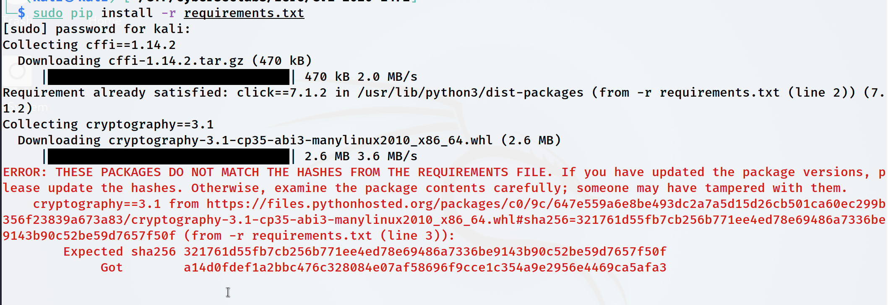

# PIP Hash Mismatches

On occasion I've run into like the following: 

```
└─$ sudo pip install -r requirements.txt                                                                             
[sudo] password for kali:                                                                                            
Collecting cffi==1.14.2                                                                                              
  Downloading cffi-1.14.2.tar.gz (470 kB)                                                                            
     |████████████████████████████████| 470 kB 2.0 MB/s                                                              
Requirement already satisfied: click==7.1.2 in /usr/lib/python3/dist-packages (from -r requirements.txt (line 2)) (7.
1.2)                                                                                                                 
Collecting cryptography==3.1                                                                                         
  Downloading cryptography-3.1-cp35-abi3-manylinux2010_x86_64.whl (2.6 MB)                                           
     |████████████████████████████████| 2.6 MB 3.6 MB/s                                                              
ERROR: THESE PACKAGES DO NOT MATCH THE HASHES FROM THE REQUIREMENTS FILE. If you have updated the package versions, p
lease update the hashes. Otherwise, examine the package contents carefully; someone may have tampered with them.     
    cryptography==3.1 from https://files.pythonhosted.org/packages/c0/9c/647e559a6e8be493dc2a7a5d15d26cb501ca60ec299b
356f23839a673a83/cryptography-3.1-cp35-abi3-manylinux2010_x86_64.whl#sha256=321761d55fb7cb256b771ee4ed78e69486a7336be
9143b90c52be59d7657f50f (from -r requirements.txt (line 3)):                                                         
        Expected sha256 321761d55fb7cb256b771ee4ed78e69486a7336be9143b90c52be59d7657f50f                             
             Got        a14d0fdef1a2bbc476c328084e07af58696f9cce1c354a9e2956e4469ca5afa3       

````




Using the `--no-cache-dir` flag will often fix this. 

But it's probably better to simply use `virtualenv`. 